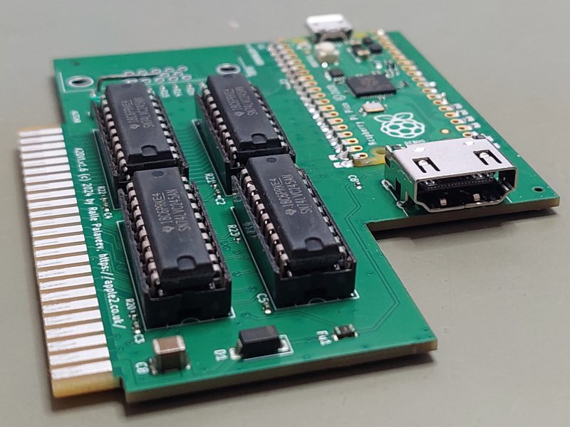
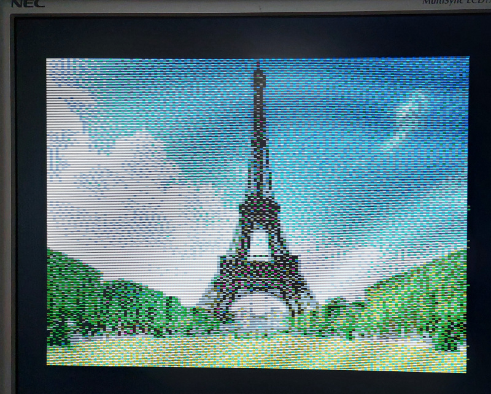
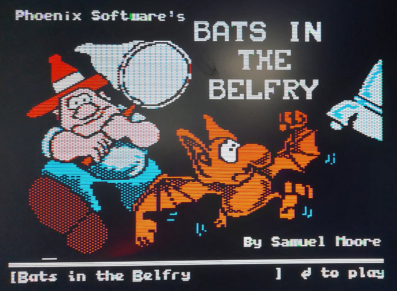
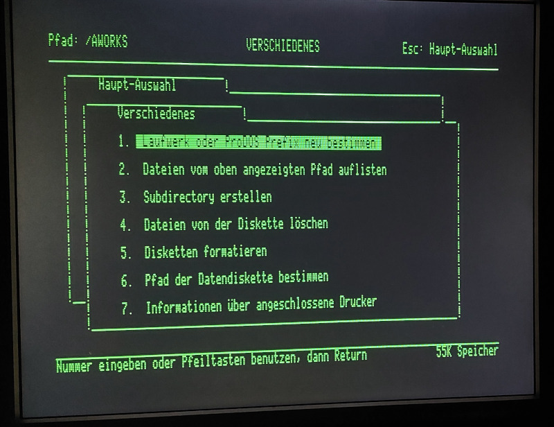

# A2DVI Firmware: Apple II Digital Video

This is a firmware project for a digital DVI/HDMI Apple II video card.
It directly produces a digital video stream from the Apple II's memory content.
The signal is output via an HDMI connector, connecting the Apple II to modern displays with HDMI (or DVI) inputs.
No more analog signal conversion required.

The project is a collaboration with Ralle Palaveev. His related hardware project is here:

* [A2DVI Hardware](https://github.com/rallepalaveev/A2DVI)

<b>
Hardware and firmware are already working, however, the project is currently being tested.
Firmware builds and Gerber files will be published once initial testing is completed.
Currently (July 2024) we're waiting for a batch of updated PCBs.
</b>

<b>
Please be a little patient.
Check out the discussion topic in the AppleFritter forum, if you want to help with testing.
</b>

# About the A2DVI-Firmware
The firmware is based on a combination of the Apple II VGA firmware projects by Mark Aikens and David Kuder.
The DVI signal generation is based on the PicoDVI library by Luke Wren.
However, A2DVI uses custom rendering code, to convert the Apple II memory content to a "TMDS" bit stream directly - skipping the intermediate step of generating a VGA buffer for PicoDVI first.

Here's a brief look at the architecture:

<pre>
                      +-------------------------------------------------------------------------+
                      |                         PICO Microcontroller (RP2040)                   |
                      |                                                                         |
     +------+         |     +---------+         +-----------------+        +-----------------+  |
     | 6502 |_________|_____| PIO #1  |_________|   ARM Core #1   |________|   ARM Core #2   |  |
     | CPU  |  Apple  |GPIO |I/O State|  32bit  |6502 bus snooping| Shared |PICO DVI + custom|  |
     +------+   Bus   |Pins | Machine |  FIFO   |memory shadowing | Memory |  TMDS rendering |  |
                      |     +---------+         +-----------------+        +-------+---------+  |
                      |                                                         DMA|1.2GByte/s  |
                      |                                                       +----+----+       |
                      |                                                       | PIO #2  |       |
                      |                                                       |I/O State|       |
                      |                                                       | Machine |       |
                      |                                                       +---+++---+       |
                      |                                                       GPIO|||3x252mbit/s|
                      +-----------------------------------------------------------|||-----------+
                                                                            +-----+++------+
                                                                            |HDMI connector|
                                                                            | 640x480@60Hz |
                                                                            +--------------+
</pre>

# Configuration
The firmware supports various configuration properties.
There are configuration utility disks for [ProDOS](/configutil/A2DVICONFIG_PRODOS.po) and [DOS3.3](/configutil/A2DVICONFIG_DOS33.dsk).

## Dual Language Support for Euro-Machines
The A2DVI-Firmware has dual language support. If you have a "Euro-Apple IIe" with the language switch on the bottom side of your Apple II keyboard, then select "**LANGUAGE SWITCH: ENABLED**" in the configuration utility and select, both, the primary and secondary character set (primary is any font/character set, secondary is any US character set).

If you don't know what the language switch on the Euro Apple IIs was for, see this video:
[https://www.youtube.com/watch?v=cvEjy_uI0gY](https://www.youtube.com/watch?v=cvEjy_uI0gY)

In order for the language switch to work, an additional wire needs to be installed.
Connect the single pin on the A2DVI card to the language switch signal "ALTCHR", at J19, front pin facing towards the keyboard:

# Photos
Here are some photos showing A2DVI in action - using the DVI/HDMI connection.

*Yes, I know you cannot tell from blurry photos whether these were from an analog or digital connection - or even from an emulator. But - trust me...* :D

# Project Status

## Completed Features

* **40 column mode**

* **80 column mode**

* **LORES graphics**

* **Double-LORES graphics**: monochrome only / color support pending.

* **HIRES graphics**

* **Double-HIRES graphics**

* **graphics/text mix modes**

* **Scanline emulation**

* **Monochrome mode** and **monochrome color** configurable (b/w, green, amber).

* **Character sets** configurable.

* **Language/rocker switch** support for Euro-machines.

* **Flash** (permanent) vs temporary configuration.

* **Card registers** for configuration.

* **Configuration menu**.

## TODOs

* Double-LORES in color.

* Custom fonts.

# License
The A2DVI firmware is released under the [MIT License](/LICENSE):

* Copyright (c) 2024 Thorsten Brehm

A2DVI was an idea by Ralle Palaveev. His matching hardware project:

* [A2DVI Hardware](https://github.com/rallepalaveev/A2DVI). MIT License. Copyright (c) 2024 Ralle Palaveev.

The firmware project is based on awesome work from the following Apple II Analog VGA projects:

* [AppleII-VGA](https://github.com/markadev/AppleII-VGA). MIT License. Copyright (c) 2021-2022 Mark Aikens.

* [Analog Firmware](https://github.com/V2RetroComputing/analog-firmware). MIT License. Copyright (c) 2022-2023 David Kuder.

This project uses a customized variant of the PicoDVI library - and reuses many of Luke's genius ideas for the custom *Apple II to DVI/TMDS* encoding:

* [PicoDVI](https://github.com/Wren6991/PicoDVI). [BSD3 License](/libraries/libdvi/LICENSE). Copyright (c) 2021 Luke Wren.

 

*Apple II Forever!*
