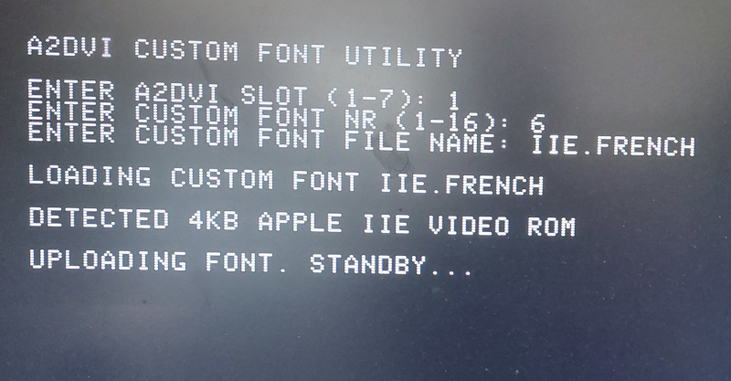
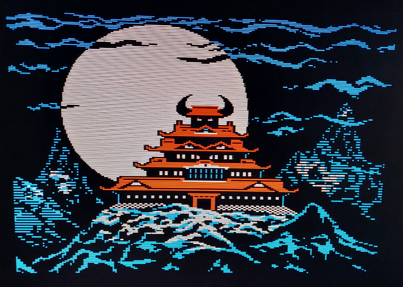
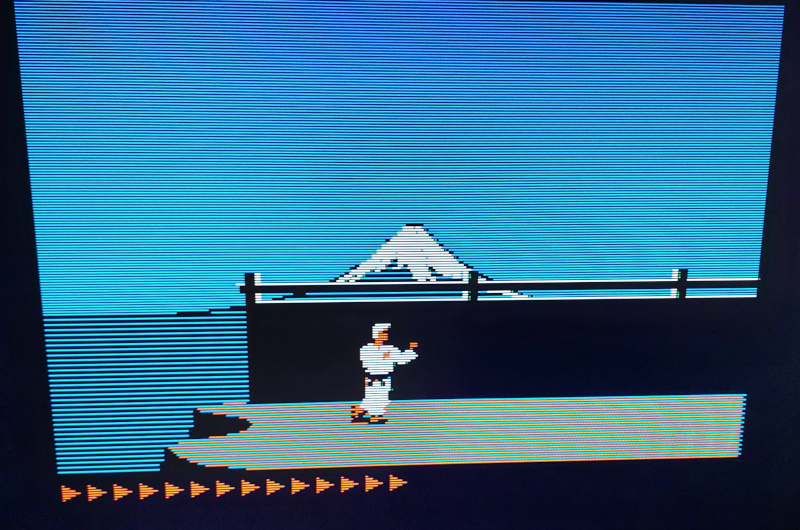
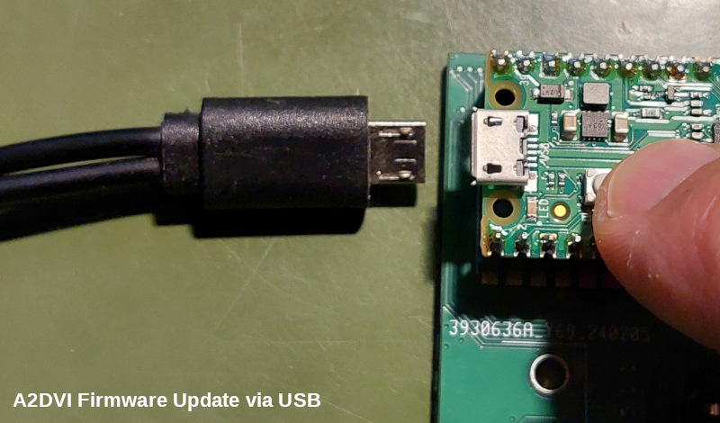

# A2DVI Firmware: Digital Video for Apple II Computers

This is a firmware project for a digital DVI/HDMI video card for Apple II.
It directly produces a digital video stream from the Apple II's memory content.
The signal is output via an HDMI connector, connecting the Apple II to modern displays with HDMI (or DVI) inputs.
No more analog signal conversion required.

The project is a collaboration with Ralle Palaveev. His related hardware project is here:

* [A2DVI Hardware](https://github.com/rallepalaveev/A2DVI)

The hardware is based on the PICO controller board.
Both, original **PICO (RP2040)** and newer **PICO2 (RP2350)** mouldes are supported.
Separate firmware is provided for the two PICO variants.

*Currently, there is no difference in A2DVI functionality when using PICO or PICO2.
PICO2 is pin-compatible but has a more powerful CPU, more memory, more flash and improved I/O.
However, the original PICO is capable enough for A2DVI - and still has resources available for future extensions.*

# About the A2DVI-Firmware
The firmware is based on a combination of the Apple II VGA firmware projects by Mark Aikens and David Kuder.
The DVI signal generation is based on the PicoDVI library by Luke Wren.
However, A2DVI uses custom rendering code, to convert the Apple II memory content to a "TMDS" bit stream directly - skipping the intermediate step of generating a VGA buffer for PicoDVI first.

Here's a brief look at the architecture:

<pre>
                      +-------------------------------------------------------------------------+
                      |                   PICO Microcontroller (RP2040 or RP2350)               |
                      |                                                                         |
     +------+         |     +---------+         +-----------------+        +-----------------+  |
     | 6502 |_________|_____| PIO #1  |_________|   ARM Core #1   |________|   ARM Core #2   |  |
     | CPU  |  Apple  |GPIO |I/O State|  32bit  |6502 bus snooping| Shared |PICO DVI + custom|  |
     +------+   Bus   |Pins | Machine |  FIFO   |memory shadowing | Memory |  TMDS rendering |  |
                      |     +---------+         +-----------------+        +-------+---------+  |
                      |                                                         DMA|1.2GByte/s  |
                      |                                                       +----+----+       |
                      |                                                       | PIO #2  |       |
                      |                                                       |I/O State|       |
                      |                                                       | Machine |       |
                      |                                                       +---+++---+       |
                      |                                                       GPIO|||3x252mbit/s|
                      +-----------------------------------------------------------|||-----------+
                                                                            +-----+++------+
                                                                            |HDMI connector|
                                                                            | 640x480@60Hz |
                                                                            +--------------+
</pre>

# Configuration
The firmware supports various configuration properties.
There are configuration utility disks for [ProDOS](/configutil/A2DVICONFIG_PRODOS.po) and [DOS3.3](/configutil/A2DVICONFIG_DOS33.dsk).

## Built-in Fonts
The firmware has built-in support for various fonts. Additional custom fonts can be uploaded using normal Apple II/IIe video ROM binaries.

Included fonts for Apple IIe:

* **US**, **UK**, **French**, **German**, **Italian**, **Spanish**, **Swedish/Finnish**, **Hebrew**, **Pravetz/Cyrillic**

* The IIe fonts are "*enhanced character sets*" (include "mouse text characters" required for the "*enhanced* //e").
There is a separate configuration option to disable "enhanced fonts": this replaces the mousetext characters with normal characters, like on an original "*unenhanced* Apple //e".

Included fonts for Apple II:

* **US**, **VIDEX**, **Katakana**, ...

## Custom Fonts
Custom video ROMs for Apple II and IIe are supported and can be uploaded with the ProDOS/DOS configuration utility.

Supported formats:

* **Apple II 2KB** video ROMs
* **Apple IIe 4KB** video ROMs
* **Apple IIe 8KB** Dual-Language video ROMs

The configuration utility automatically detects the correct format of the uploaded video ROM (based on the file size), since the Apple II and IIe video ROMs used different formats (bit reversed & inverted).

## Dual Language Support for Euro-Machines
The A2DVI-Firmware has dual language support. If you have a "Euro-Apple IIe" with the language switch on the bottom side of your Apple II keyboard, then select "**LANGUAGE SWITCH: ENABLED**" in the configuration utility and select, both, the primary and secondary character set (primary is any font/character set, secondary is any US character set).

If you don't know what the language switch on the Euro Apple IIs was for, see this video:
[https://www.youtube.com/watch?v=cvEjy_uI0gY](https://www.youtube.com/watch?v=cvEjy_uI0gY)

In order for the language switch to work, an additional wire needs to be installed.
Connect the single pin on the A2DVI card to the language switch signal "ALTCHR", at J19, front pin facing towards the keyboard:

## Debug Lines
The configuration menu offers a debugging feature. Enabling "DEBUG LINES" shows extra lines above and below the normal Apple II screen (in red):

The first line shows the status of switches controlling Apple II's video subsystem:

* **TEXT**, **GR** (LORES graphics), **DGR** (double LORES), **HGR** (HIRES), **DHGR** (double HIRES): the active video mode.
* **MIX**: text/graphics mix mode enabled.
* **40**/**80**: 40/80 column display mode selected.
* **P1**/**P2**: Display page 1 or 2 selected.
* **MONOCHROME**: Monochrome mode selected.
* **ALTCHAR**: Alternate characters selected.
* **V7:n**: Selected Video7 mode.

The second line shows *soft switches* controlling Apple II(e)'s memory subsystem:

* **80STR**: 80STORE is selected (page 2 switches between main/auxiliary memory, instead of toggling P1/P2 pages).
* **AUXR**: Auxiliary Read is selected (reading from auxiliary memory, beyond 64KB).
* **AUXW**: Auxiliary Write is selected (writing to auxiliary memory, beyond 64KB).
* **AUXZ**: Auxiliary Zero-Page is selected (zero-page in auxiliary memory).
* **C3ROM**: Slot 3 ROM is disabled (memory bank enabled).
* **CXROM**: CX00 ROM area is disabled (memory bank enabled).
* **IOUD**: "IOU disable" is selected (IOU access for addresses $C058 to $C05F disabled).

The line below the Apple II screen shows 6502 activity:

* **PC**: current program counter (6502 execution address).
* **S**: stack pointer (in fact: most recent memory access to stack page).
* **ZP**: most recent address accessed in zero-page.

The displayed program counter and stack pointer isn't exact science. Of course, the 6502 runs to far quickly to see all addresses. And the card doesn't know the register contents of the 6502, however, it sees every bus cycle and every memory access. So it sees access to the stack area (0x100-0x1ff) and the addresses of instruction fetches.
This can be helpful when debugging a program. It's also just cool (though maybe a bit nerdy :) ) to be able to see what the 6502 is currently doing.

# Photos
Here are some photos showing A2DVI in action - using the DVI/HDMI connection.

*Yes, I know you cannot tell from blurry photos whether these were from an analog or digital connection - or even from an emulator. But - trust me...* :D

# Firmware Updates
Firmware updates of an A2DVI card are easy and safe:

1. Switch off your Apple II. (*It's otherwise safe to update the A2DVI card while it is still plugged in the Apple II.*)
2. Press the white "BOOTSEL" button on top of the A2DVI's PICO module. *Keep the button depressed.*
3. While the button is still depressed, connect the USB cable between your PC/Mac and the PICO module.
4. Your PC/Mac should recognize a new mass storage device.
5. Drag & drop the firmware file from the Release's ZIP-file (e.g. "A2DVI-vX.Y.uf2", see [Releases](https://github.com/ThorstenBr/A2DVI-Firmware/releases)) to the mass storage drive.
6. After 2 seconds the LED should light up. The firmware update is complete.
7. Disconnect the USB cable. Switch on the Apple II... :)

# Project Status

## Completed Features

* **40 column mode**

* **80 column mode**

* **LORES graphics**

* **Double-LORES graphics**: monochrome only / color support pending.

* **HIRES graphics**

* **Double-HIRES graphics**

* **graphics/text mix modes**

* **Video-7 40 column color mode**

* **Scanline emulation**

* **Monochrome mode** and **monochrome color** configurable (b/w, green, amber).

* **Character sets** configurable.

* **Language/rocker switch** support for Euro-machines.

* **Flash** (permanent) vs temporary configuration.

* **Card registers** for configuration.

* **Configuration menu**.

* **Custom fonts**.

* **Debug display**.

* **PICO2 (RP2350) support**.

## TODOs

* Double-LORES in color.

# License
The A2DVI firmware is released under the [MIT License](https://github.com/ThorstenBr/A2DVI-Firmware/blob/master/LICENSE):

* Copyright (c) 2024 Thorsten Brehm

A2DVI was an idea by Ralle Palaveev. His matching hardware project:

* [A2DVI Hardware](https://github.com/rallepalaveev/A2DVI). MIT License. Copyright (c) 2024 Ralle Palaveev.

The firmware project is based on awesome work from the following Apple II Analog VGA projects:

* [AppleII-VGA](https://github.com/markadev/AppleII-VGA). MIT License. Copyright (c) 2021-2022 Mark Aikens.

* [Analog Firmware](https://github.com/V2RetroComputing/analog-firmware). MIT License. Copyright (c) 2022-2023 David Kuder.

This project uses a customized variant of the PicoDVI library - and reuses many of Luke's genius ideas for the custom *Apple II to DVI/TMDS* encoding:

* [PicoDVI](https://github.com/Wren6991/PicoDVI). [BSD3 License](/libraries/libdvi/LICENSE). Copyright (c) 2021 Luke Wren.

 

*Apple II Forever!*
